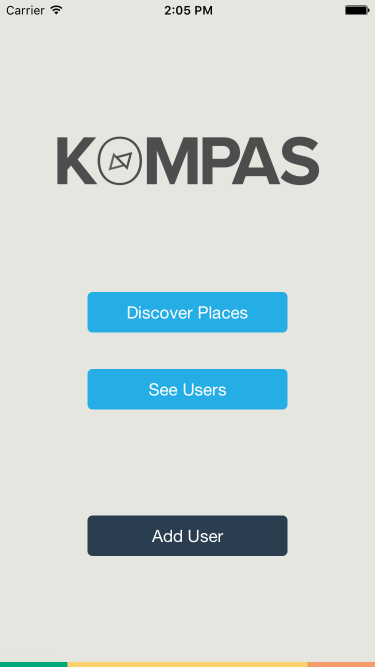

# KOMPAS CHALLENGE - Enzo TESTA

To start the project : 

- Select path to data folder in backend to start mongod on 27017
+ `mongod --dbpath ~/code_challenge/enzo_backend/data`

- Start express app on 3000: 
+ `cd ~/code_challenge/enzo_backend`
+ `DEBUG=enzo_backend:* npm start`

- Start iOS simulator : 
+ `cd ~/code_challenge/enzo_frontend`
+ `react-native run-ios`

 

# Notes 

I tested my code on an iPhone 6 simulator screen and on my iphone 5: the layout is fine in both cases =)

If any issues with the database, you can still generate it again with the command: 
+ `cd ~/code_challenge/enzo_backend`
+ `node generateBD.js`

Enjoy !

If any questions : enzotesta@hotmail.fr

